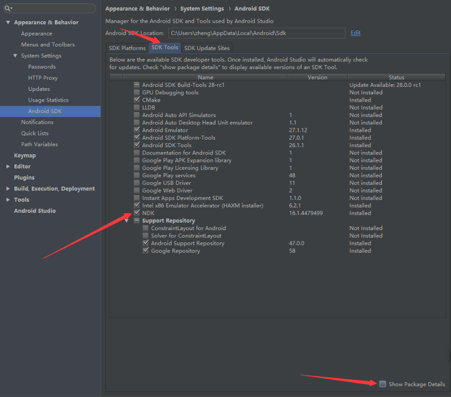
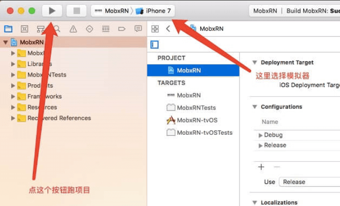
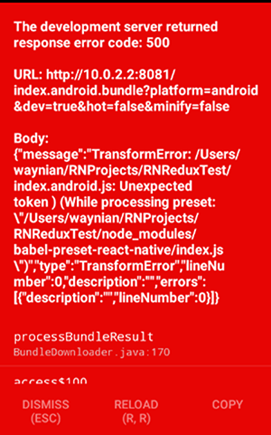
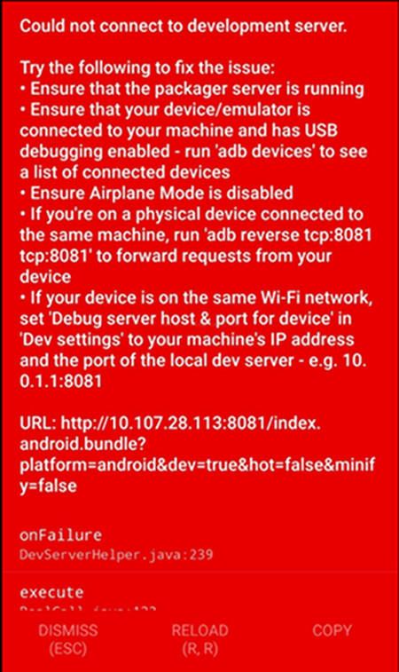
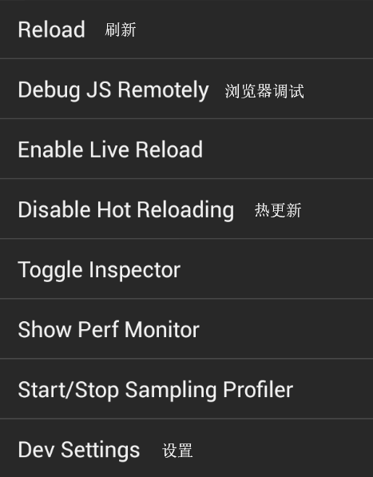

# 

_Simple, detailed, quick tutorial. Attach a demo._

## 前言
开发一款产品，通常来说你需要做三件事情：搭建开发环境 -> 写代码 + 调试 -> 打包发布。

这里不介绍[react](http://www.ruanyifeng.com/blog/2015/03/react.html)、[react-native](http://reactnative.cn/)和[ES6](http://blog.csdn.net/beverley__/article/details/78547973)语法。

## 预览

## 目录
- [项目环境及各种依赖的版本](#搭建开发环境)
-   asdasd
- [First Blood](#first-blood)
- [Android 6.0及以上修改两个文件](#android-60及以上修改两个文件)
- [Run](#run)
- [更换设备](#更换设备)
- [常用命令](#常用命令)

## 搭建开发环境
按照[react-native中文网](http://reactnative.cn/)-文档-搭建开发环境，选择需要的环境开始搭建。

配置开发环境需跳跃出那一道鸿沟，你懂得！推荐[lantern](https://github.com/getlantern/lantern)。

#### 增加SDK Tools (android)

#### 增加NDK (android)

#### 配置NDK环境变量 (android)
新建ANDROID_NDK_HOME，指向路径与下图相同，并在path中添加一遍。

## 设备的配置
#### Android
打开手机的开发者模式，打开USB调试（模拟器跳过前两句话），连接电脑成功后在终端或者cmd运行`adb devices`。
~~~
$ adb devices
List of devices attached
emulator-9845 offline      # 模拟器
JRNJVOU899999999 device    # 真实设备
~~~
注意，你只应当连接仅仅一个设备，并且当你的系统大于5.0时，运行`adb reverse tcp:8081 tcp:8081`。

**Android 6.0及以上修改两个文件**
~~~
1. 修改android/gradle/wrapper/gradle-wrapper.properties

distributionUrl=https\://services.gradle.org/distributions/gradle-2.2-all.zip
->
distributionUrl=https\://services.gradle.org/distributions/gradle-2.14.1-all.zip

2. 修改android/build.gradle

com.android.tools.build:gradle:1.2.3
->
com.android.tools.build:gradle:2.2.3
~~~

#### IOS
首先用Xcode打开`./ios/xxxx.xcodeproj`

真机调试：自行百度，开发者账号 -> 连接iphone -> 无线连接 -> iphone信任设备

## 写代码 + 调试
#### Down
~~~
git clone https://github.com/beverle-y/rn-mobx-starter.git
~~~
这样我们的代码就有啦~

#### Install
~~~
yarn install
~~~

Android需修改`./node_modules/react-native-video/android/build.gradle`中
~~~
provided 'com.facebook.react:react-native:+'
->
compile 'com.facebook.react:react-native:+'
~~~
有关其他依赖的配置方法，[点击查看](https://github.com/beverle-y/note)。

#### Run
~~~
react-native run-android
~~~
ios可以`react-native run-ios`，或者按上图的按钮。

**注意**：第一次运行`react-native run-android`到99%时会卡住，这时手机底部会出现一个提示框，询问是否安装软件，点击确定即可。ios需要在 设置 -> 通用 里信任一下。

### 调试
先来一波常见的错误

#### No connected devices！
检查是否正确连接手机并确认USB调试是否开启。

#### The development server returned response error code : 500
`babel-preset-react-native`版本太高，建议降至`babel-preset-react-native@4.0.0`

#### 下载jar失败
遇到类似下载失败的情况，复制网址下载，放到`C:\Users\zheng\AppData\Local\Android\Sdk\tools\lib`文件夹里边即可。[sdk位置](#增加sdk-tools-android)

#### Could not connect to development server.

如果系统小于5.0，此时是红屏报错状态，现在你要做几件事：
1. 首先确保你的电脑和手机设备在同一个Wi-Fi环境下。
2. 在你的手机设置里边或者手机管家里边找到权限设置，打开悬浮窗权限。
3. 回到红着屏的软件，摇晃设备打开开发者菜单。
4. 点击进入`Dev Settings`。
5. 点击`Debug server host & port for device`。
6. 输入你电脑的IP地址和端口号（譬如192.168.10.131:8081）。在Mac上，你可以在系统设置/网络里找查询你的IP地址。在Windows上，打开cmd并输入ipconfig来查询你的IP地址。
7. 回到开发者菜单然后选择`Reload JS`。
8. 如果是模拟器，跳过1和2，按`Ctrl+M`或者`Command+D`呼出开发者菜单，执行4567。

#### 小米手机
关闭`MIUI优化`，不然小米是不允许你将你的软件通过react-native run-android来安装到手机上的。

#### 呼出开发者菜单

**Android**

在设置或者手机管家里找到权限设置，打开悬浮窗权限。通过摇晃手机呼出开发者菜单。

**IOS**

直接摇

**模拟器**

按`Ctrl+M`或者`Command+D`呼出开发者菜单
## 打包
#### Android
一：在`./android/app/src/main/`新建`assets`文件夹，将资源打进去。在根目录执行：
~~~
react-native bundle --platform android --dev false --entry-file index.js --bundle-output android/app/src/main/assets/index.bundle --assets-dest android/app/src/main/res/
~~~
二：[打包](https://reactnative.cn/docs/0.51/signed-apk-android.html#content)

#### 更换设备
当你想换手机或者模拟器，并且系统不同的情况时，需要修改上文提到的[两个文件](#android-60及以上修改两个文件)，删除下边三个文件夹。
~~~
~代表项目根目录
1. ~/node_modules
2. ~/android/.gradle
3. ~/android/app/build
~~~
接着`npm install` -> `react-native start --reset-cache`->`Ctrl+c`杀掉->`react-native run-android`

## 常用命令
1. `react-native start` ~~开一个本地服务器
2. `react-native run-ios` ~~运行ios工程
3. `react-native run-android` ~~运行android工程
4. `react-native link` ~~将含有原生代码的依赖连接到工程
5. `npm install xxxx --save` 或 `yarn add xxxx` ~~安装生产环境需要的依赖
6. `npm install xxxx --save-dev` 或 `yarn add xxxx --dev` ~~安装开发环境需要的依赖
7. `npm uninstall xxxx` 或 `yarn remove xxxx` ~~卸载某一个依赖
8. `rimraf node_nodules` ~~删除node_modules文件夹，也可以删除其他文件夹，推荐全局安装[gulp-rimraf](https://www.cnblogs.com/gulei/p/5407732.html)
9. `cd android && ./gradlew assembleRelease` ~~[生成发行APK包](http://reactnative.cn/docs/0.45/signed-apk-android.html)
