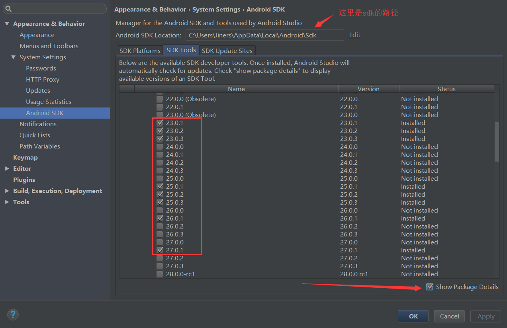
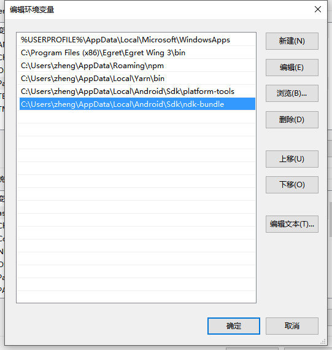

# RN Mobx Starter

本项目致力于帮助`react-native`新手小白快速上手，不介绍[react](http://www.ruanyifeng.com/blog/2015/03/react.html)、[react-native](http://reactnative.cn/)和[ES6](http://blog.csdn.net/beverley__/article/details/78547973)语法。如果你具备`react`开发经验，写代码将不是问题，坑只在于开始的配置上边。

## Preview

## 目录
- [项目环境及各种依赖的版本](#项目环境及各种依赖的版本)
- [First Blood](#first-blood)
- [Android 6.0及以上修改两个文件](#android-60及以上修改两个文件)
- [Run](#run)
- [更换设备](#更换设备)
- [常用命令](#常用命令)
## 项目环境及各种依赖的版本：
**Windows 10**：(Windows上只能开发android)
1. oppo 5.1
2. 虚拟机-android 4.2.2
3. 虚拟机-android 5.1.0
4. 虚拟机-android 7.0.0
5. 虚拟机-android 8.0
6. node 8.9.0
7. npm 5.5.1
8. python 2.7.14
9. Android Studio 3.0 (用来下载sdk)
10. javac 1.8.0_151

**MacOS 10.13.2**：
1. Xcode 9.2
2. iphone 11.2.1
3. oppo 5.1
4. 虚拟机-iphone6
5. 虚拟机-iphone8
6. 虚拟机-iphoneX
7. node 9.3.0
8. npm 5.6.0
9. Android Studio 3.0 (用来下载sdk)
10. javac 1.8.0_151

## First Blood
按照[react-native中文网](http://reactnative.cn/)-文档-搭建开发环境，请仔细仔细再仔细的按照教程把需要的环境配置起来，并收藏该网址。

配置开发环境需跳跃出那一道鸿沟，你懂得！推荐[lantern](https://github.com/getlantern/lantern)。

### 增加SDK Tools (android)

### 增加NDK (android)

### 配置NDK环境变量 (android)
新建ANDROID_NDK_HOME，指向路径与下图相同，并在path中添加一遍。

开始拉代码吧，`git clone https://github.com/beverle-y/rn-mobx-starter.git`，然后打开手机的开发者模式，打开USB调试，插到电脑上面之后运行`adb devices`。

~~~
$ adb devices
List of devices attached
emulator-9845 offline   # Google模拟器
JRNJVOU899999999 device         # 真实设备
~~~
注意，你只应当连接仅仅一个设备，并且当你的系统大于5.0时，运行`adb reverse tcp:8081 tcp:8081`。

### No connected devices！
检查是否正确连接手机并确认USB调试是否开启。

## Android 6.0及以上修改两个文件
~~~
1. 修改android/gradle/wrapper/gradle-wrapper.properties
distributionUrl=https\://services.gradle.org/distributions/gradle-2.2-all.zip
->
distributionUrl=https\://services.gradle.org/distributions/gradle-2.14.1-all.zip
2. 修改android/build.gradle
com.android.tools.build:gradle:1.2.3
->
com.android.tools.build:gradle:2.2.3
~~~

clone完成以后进入项目文件夹`cd rn-mobx-starter`&&`yarn`等待下载........100%

## Run
根据系统选择执行`react-native run-android`还是`react-native run-ios`

如果Android系统大于5.0，执行成功后手机上会出现启动屏，观察server窗口bundle.js编译完成后启动屏会在两秒后消失进入主程序。

**如果系统小于5.0**，此时是红屏报错状态，现在你要做几件事：

1. 首先确保你的电脑和手机设备在同一个Wi-Fi环境下。
2. 在你的手机设置里边或者手机管家里边找到权限设置，打开悬浮窗权限。
3. 回到红着屏的软件，摇晃设备打开开发者菜单。
4. 点击进入`Dev Settings`。
5. 点击`Debug server host for device`。
6. 输入你电脑的IP地址和端口号（譬如192.168.10.131:8081）。在Mac上，你可以在系统设置/网络里找查询你的IP地址。在Windows上，打开cmd并输入ipconfig来查询你的IP地址。
7. 回到开发者菜单然后选择`Reload JS`。
8. 如果是模拟器，跳过1和2，按`Ctrl+m`或者`Command+m`呼出开发者菜单，执行4567。

**如果你是小米手机**，去关闭`MIUI优化`，不然小米是不允许你将你的软件通过react-native run-android来安装到手机上的。

**注意**：第一次运行`react-native run-android`到99%时，会卡住，这时手机底部会出现一个提示框，询问是否安装软件，点击确定即可。ios需要在设置 ->通用里信任一下。

### The development server returned response error code : 500
`babel-preset-react-native`版本太高，建议降至`babel-preset-react-native@4.0.0`

### 下载jar失败
遇到类似下载失败的情况，复制网址下载，放到`C:\Users\zheng\AppData\Local\Android\Sdk\tools\lib`文件夹里边即可。

## 安卓打包Release.apk图片不显示
在根目录下执行
~~~
react-native bundle --platform android --dev false --entry-file index.js --bundle-output android/app/src/main/assets/index.bundle --assets-dest android/app/src/main/res/
~~~

## 更换设备
当你想换手机或者模拟器，并且系统不同的情况时，需要修改上文提到的两个文件，删除下边三个文件夹。
~~~
~代表项目根目录
1. ~/node_modules
2. ~/android/.gradle
3. ~/android/app/build
~~~
接着`npm install` -> `react-native start --reset-cache`->`Ctrl+c`杀掉->`react-native run-android`

## 常用命令
1. `react-native start` ~~开一个本地服务器
2. `react-native run-ios` ~~运行ios工程
3. `react-native run-android` ~~运行android工程
4. `react-native link` ~~将含有原生代码的依赖连接到工程
5. `npm install xxxx --save` 或 `yarn add xxxx` ~~安装生产环境需要的依赖
6. `npm install xxxx --save-dev` 或 `yarn add xxxx --dev` ~~安装开发环境需要的依赖
7. `npm uninstall xxxx` 或 `yarn remove xxxx` ~~卸载某一个依赖
8. `rimraf node_nodules` ~~删除node_modules文件夹，也可以删除其他文件夹，推荐全局安装[gulp-rimraf](https://www.cnblogs.com/gulei/p/5407732.html)
9. `cd android && ./gradlew assembleRelease` ~~[生成发行APK包](http://reactnative.cn/docs/0.45/signed-apk-android.html)
